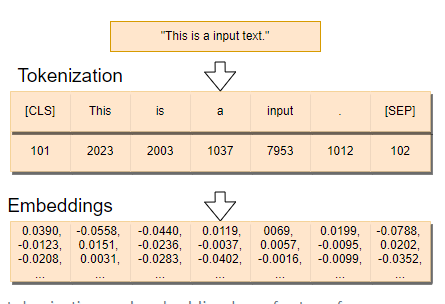
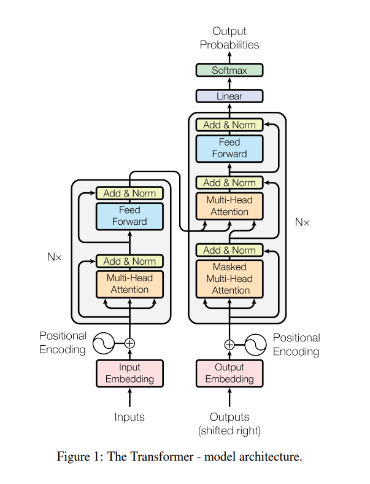
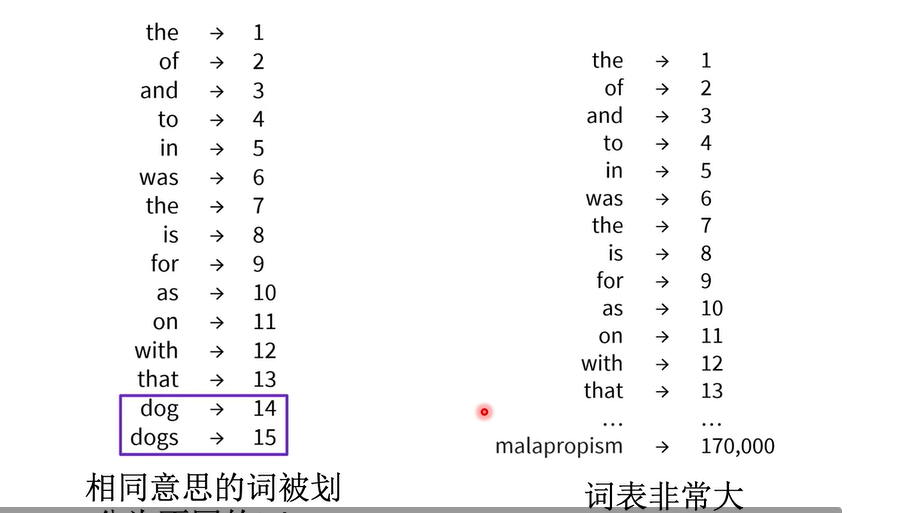
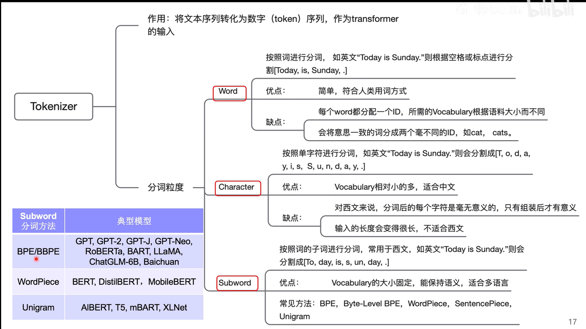

# tokenizer的定义

>tokenizer也叫分词器

作用：

- **文本序列**通过 Tokenizer 被转化为**数字序列**（token 编号/id）。
- 是训练和微调大型语言模型（LLM）必不可少的一部分。  
  
---



---
Tokenizer 在transformer的架构中处于**Embdedding Input**区域，如图（内置） l




# 不同粒度的分词

## Word-based Tokenizers



Word level 分词一般通过空格或者标点符号来把文本分成一个个单词，这样分词之后的 token 数量就不会太多，比如 Today is a good day -> Today, is, a, good, day。但 Word level 分词也有问题，比如英文中的 high, higher, highest 这三个单词显然语义相似，因为另外两个只是比较级，但是 Word level 分词会把他们看成 3 个单独的单词

>优点：符合人的自然语言直觉

>缺点：很多相同意义的词分到一起，词表很大le

<br>

## Character-based Tokenizers

顾名思义，就是把文本拆分成一个个字符单独表示，比如 highest -> h, i, g, h, e, s, t，一个显然的好处是，Vocab 不会太大，Vocab 的大小为字符集的大小，也不会遇到 Out-of-vocabulary(OOV) 的问题，但是字符本身并没有传达太多的语义，而且分词之后会有太多的 token，光是一个 highest 就可以得到 7 个 token，难以想象很长的文本分出来会有多少个😨

<br>


## Subword-based Tokenizers
基于词的字词来切分





总结来说，基于Subword该粒度的切分效果是最好的。所以接下来的分词算法都是Subword的变体。
<br>

*
-
-
-
# 有关Subword的tokenizer算法

## BPE
接下来正式介绍 BPE 分词算法的训练流程，假设我们手头有一堆文档 $D={d_1,d_2,…}$

1. 把每个文档 $d$ 变成单词列表，比如你可以简单用空格分词
2. 统计每个单词 $w$ 在所有文档 $D$ 中的出现频率，并计算初始字符集 alphabet 作为一开始的 Vocab（包括后面的 </w>），字符集的意思就是所有文档 $D$ 中不同的字符集合
3. 先将每个单词划分为一个个 utf-8 char，称为一个划分，比如 highest -> h, i, g, h, e, s, t
4. 然后，在每个单词的划分最后面加上 </w>，那么现在 highest -> h, i, g, h, e, s, t, </w>
5. 重复下面步骤直到满足两个条件中的任意一个：1）Vocab 达到上限。2）达到最大迭代次数

找到最经常一起出现的 pair，并记录这个合并规则，放在 merge table 里面，同时把合并之后的结果放到 Vocab 里面
更新所有单词的划分，假设我们发现 (h, i) 最经常一起出现，那么 hi 就会被添加到 Vocab 里面，同时修改划分方式为：highest -> hi, g, h, e, s, t, </w>


你可能会有下面 3 个疑惑：

- 为什么要统计词频？因为统计词频会让找最经常出现的 pair 这件事变得简单
- 为什么要加 </w>？因为我们希望能够还原输入，因此需要做个标记表示这是单词之间的边界
- 如果多个 pair 的词频一样怎么处理？这个不同实现可能不一样，但在我看来应该关系不大

### BPE的例子

停留在算法不提供例子的话，经常还是会云里雾里，所以现在来结合一个例子看 BPE 是如何工作的

比如语料库是

```
corpus = ["highest", "higher", "lower", "lowest", "cooler", "coolest"]
```
这里跳过统计词频，因为每一个都是 1。先把每个单词变成一个个 utf-8 字符然后加上 </w>

```
{
    "highest": ["h", "i", "g", "h", "e", "s", "t", "</w>"],
    "higher": ["h", "i", "g", "h", "e", "r", "</w>"],
    "lower": ["l", "o", "w", "e", "r", "</w>"],
    "lowest": ["l", "o", "w", "e", "s", "t", "</w>"],
    "cooler": ["c", "o", "o", "l", "e", "r", "</w>"],
    "collest": ["c", "o", "o", "l", "e", "s", "t", "</w>"],
}
```
可以看到 (e, s) 总共出现了 3 次，是最多次的，将 es 添加到 Vocab 里面，然后重新划分。注意这里 (e, r) 其实也有一样的出现频率，所以选 (e, r) 合并也是可以的

```
{
    "highest": ["h", "i", "g", "h", "es", "t", "</w>"],
    "higher": ["h", "i", "g", "h", "e", "r", "</w>"],
    "lower": ["l", "o", "w", "e", "r", "</w>"],
    "lowest": ["l", "o", "w", "es", "t", "</w>"],
    "cooler": ["c", "o", "o", "l", "e", "r", "</w>"],
    "collest": ["c", "o", "o", "l", "es", "t", "</w>"],
}
```
接下来发现最多的是 (es, t)，更新划分
```

{
    "highest": ["h", "i", "g", "h", "est", "</w>"],
    "higher": ["h", "i", "g", "h", "e", "r", "</w>"],
    "lower": ["l", "o", "w", "e", "r", "</w>"],
    "lowest": ["l", "o", "w", "est", "</w>"],
    "cooler": ["c", "o", "o", "l", "e", "r", "</w>"],
    "collest": ["c", "o", "o", "l", "est", "</w>"],
}
```
接下来发现最多的是 (est, </w>)，更新划分
```

{
    "highest": ["h", "i", "g", "h", "est</w>"],
    "higher": ["h", "i", "g", "h", "e", "r", "</w>"],
    "lower": ["l", "o", "w", "e", "r", "</w>"],
    "lowest": ["l", "o", "w", "est</w>"],
    "cooler": ["c", "o", "o", "l", "e", "r", "</w>"],
    "collest": ["c", "o", "o", "l", "est</w>"],
}
```
接下来发现最多的是 (e, r)，更新划分

```
{
    "highest": ["h", "i", "g", "h", "est</w>"],
    "higher": ["h", "i", "g", "h", "er", "</w>"],
    "lower": ["l", "o", "w", "er", "</w>"],
    "lowest": ["l", "o", "w", "est</w>"],
    "cooler": ["c", "o", "o", "l", "er", "</w>"],
    "collest": ["c", "o", "o", "l", "est</w>"],
}
```
接下来发现最多的是 (er, </w>)，更新划分
```
{
    "highest": ["h", "i", "g", "h", "est</w>"],
    "higher": ["h", "i", "g", "h", "er</w>"],
    "lower": ["l", "o", "w", "er</w>"],
    "lowest": ["l", "o", "w", "est</w>"],
    "cooler": ["c", "o", "o", "l", "er</w>"],
    "collest": ["c", "o", "o", "l", "est</w>"],
} 
```

具体的算法代码去看 [BPE算法代码](./BPE/bpe.ipynb)
<br>
<hr>

## WorldPiece 


<br>
<hr>
## SententcePiece


